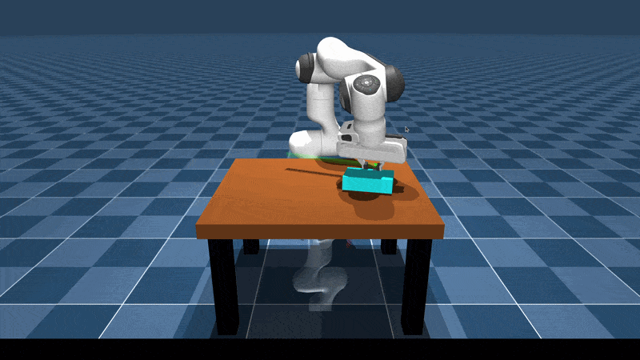
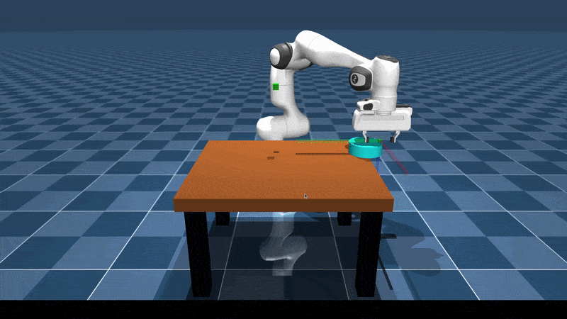

# ContactMJGym

[](https://github.com/Sherif-Sameh/ContactMJGym/actions/workflows/tests.yaml?query=branch%3Amain)
[](https://www.python.org/)
[](https://mujoco.org/)
[](https://pixi.sh/)
[](LICENSE)

### A MuJoCo-Based Gym for Contact-Rich Robotic Manipulation Goal-Based Environments

<p align="center">
  
  
</p>

## Features

- **Dynamic Scene Generation:** Environments are built programmatically from base MJCFs sourced from [MuJoCo Menagerie](https://github.com/google-deepmind/mujoco_menagerie), so a single environment definition can support many robot + gripper + object combinations.
- **Domain Randomization:** Randomization of initial state and model parameters, covering actuator, body, geom, and joint attributes, through a flexible noise model.
- **Curriculum Learning:** Curriculums for arbitrary environment attributes, with support for fixed linear and cosine-annealed schedules.
- **Task-Space Control:** Modular and flexible architecture implemented as action wrappers, supporting an arbitrary number of robots and gripper/no-gripper configurations. Support for configurable compensation terms: full bias, gravity-only, damping, friction, and inertia. Support for fixed or variable stiffness/damping gains and smooth torque control with no MJCF modifications required.
  - **Mocap:** A mocap + weld constraint controller (FetchEnv approach), with the inherited flexibility of the base controller. Supports null-space projection for joint-configuration regularization commands.
  - **Mink:**: A controller built on [mink](https://github.com/kevinzakka/mink)'s QP formulation and solver. Adds a posture task for regularization and a configuration limit constraint by default, and supports adding further constraints.
  - **OSC:** Operational space control with a dynamically consistent Jacobian/null-space projector, decoupled linear/angular dynamics, and configuration regularization via null-space projection.
- **Teleoperation:** 6-DoF full-pose control plus gripper, speed, and brake control via the keyboard.

### Environments

- **EdgeGrasp:** A large, thin object starts lying flat on a table and cannot be grasped directly. Goals are sampled both on the table and above it. Table-level goals only require pushing the object to its target; goals above the table require pushing the object to the table's edge without letting it fall, grasping it from its thin edge, and lifting it to the target.

## Installation Instructions

The package is managed with [Pixi](https://pixi.sh/).

```bash
# 1. Install Pixi (see https://pixi.sh for platform-specific instructions)
curl -fsSL https://pixi.sh/install.sh | sh

# 2. Clone the repo
git clone https://github.com/Sherif-Sameh/ContactMJGym
cd ContactMJGym

# 3. Install the default environment
pixi install

# 4. Fetch the robot/gripper mesh and texture assets from MuJoCo Menagerie
#    (heavy binary files that are not tracked in the repo)
pixi run fetch-robots

# 5. Start shell session inside the default environment
pixi shell 
```

After installation, verify that the package was installed correctly:

```bash
# Random-noise agent
python scripts/simple_agent.py --env_name "EdgeGrasp-v0" --act_scale 0.01 

# Keyboard teleop with mocap controller
# (enable geom group 4 to visualize the goal and TCP target)
python scripts/keyboard_teleop.py --env_name "EdgeGrasp-v0" --controller mocap
```

You can also measure headless simulation throughput:

```bash
# Measure FPS for 10 episodes without controllers
python scripts/measure_fps.py --env_name "EdgeGrasp-v0" --n_episodes 10

# Measure FPS for 10 episodes with mocap controller
python scripts/measure_fps.py --env_name "EdgeGrasp-v0" --n_episodes 10 --controller mocap
```

## Example Usage

### Minimal Examples

Create an environment with default configuration:

```python
import gymnasium as gym

import contact_gym  # noqa: F401

env = gym.make("contact_gym/EdgeGrasp-v0")
```

Create environments with non-default configuration and task-space controller wrappers:

```bash
# Install additional mink dependencies and start shell session
pixi shell -e mink
```

```python
import gymnasium as gym

import contact_gym  # noqa: F401
from contact_gym.envs import EdgeGraspEnvCfg
from contact_gym.wrappers.controllers import MinkControllerCfg, OscControllerAction

SceneCfg = EdgeGraspEnvCfg.SceneCfg

# Custom scene configuration with dense rewards and non-zero guiding terms
cfg = EdgeGraspEnvCfg(scene_cfg=SceneCfg(robot="fr3"))
cfg.weights.tcp_dist = 0.05
cfg.weights.con = 0.01
env = gym.make("contact_gym/EdgeGrasp-v0", cfg=cfg, reward_type="dense")
env = MinkControllerCfg(env)

# Custom scene configuration with sparse rewards
cfg = EdgeGraspEnvCfg(scene_cfg=SceneCfg(object="puck"))
env = gym.make("contact_gym/EdgeGrasp-v0", cfg=cfg, reward_type="sparse")
env = OscControllerAction(env)
```

### Example Scripts

Two scripts under [`scripts/`](scripts/) walk through key features. Read through them and run them directly.

| Script | Showcases |
| --- | --- |
| `scripts/sample_dr.py` | Domain randomization of model and initial-state parameters |
| `scripts/sample_curriculum.py` | Curriculum scheduling over domain randomization parameters |

```bash
python scripts/sample_dr.py --object block --seed 0
python scripts/sample_curriculum.py --object puck --seed 0
```

### Stable-Baselines3 Examples

These live under [`examples/sb3/`](examples/sb3) in a separate `sb3` Pixi environment to keep the core install lean:

```bash
pixi shell -e sb3
```

| Example | Setup | Expected Result |
| --- | --- | --- |
| `examples/sb3/sac/train.py` | SAC, dense reward, mocap controller, block object, table-only goals | Reaches 100% success rate |
| `examples/sb3/td3/train.py` | TD3, dense reward, mink controller, puck object, mixed table/air goals | Does not solve the full task through simple Gaussian-policy random exploration. Solves table goals but pushes object off the table for air goals.

```bash
python -m examples.sb3.sac.train --config examples/sb3/sac/config/edge_grasp_dense.toml
python -m examples.sb3.td3.train --config examples/sb3/td3/config/edge_grasp_dense.toml
```

These two SB3 examples are meant primarily as setup references for training, not as tuned, ready-to-use baselines.


## References

### Repositories

```bibtex
@software{menagerie2022github,
    author = {Zakka, Kevin and Tassa, Yuval and {MuJoCo Menagerie Contributors}},
    title = {{MuJoCo Menagerie: A collection of high-quality simulation models for MuJoCo}},
    url = {http://github.com/google-deepmind/mujoco_menagerie},
    year = {2022},
}

@software{Zakka_Mink_Python_inverse_2026,
    author = {Zakka, Kevin},
    title = {{Mink: Python inverse kinematics based on MuJoCo}},
    year = {2026},
    month = feb,
    version = {1.1.0},
    url = {https://github.com/kevinzakka/mink},
    license = {Apache-2.0}
}

@article{Khatib1987,
    author  = {Khatib, Oussama},
    title   = {A unified approach for motion and force control of robot manipulators: The operational space formulation},
    journal = {IEEE Journal of Robotics and Automation},
    volume  = {3},
    number  = {1},
    pages   = {43--53},
    year    = {1987},
    month   = feb,
    doi     = {10.1109/JRA.1987.1087068}
}

@article{stable-baselines3,
    author  = {Antonin Raffin and Ashley Hill and Adam Gleave and Anssi Kanervisto and Maximilian Ernestus and Noah Dormann},
    title   = {Stable-Baselines3: Reliable Reinforcement Learning Implementations},
    journal = {Journal of Machine Learning Research},
    year    = {2021},
    volume  = {22},
    number  = {268},
    pages   = {1-8},
    url     = {https://jmlr.org/papers/v22/20-1364.html}
}
```